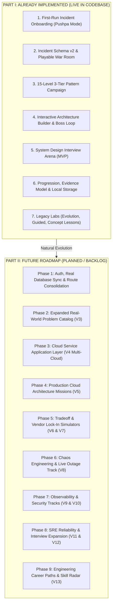
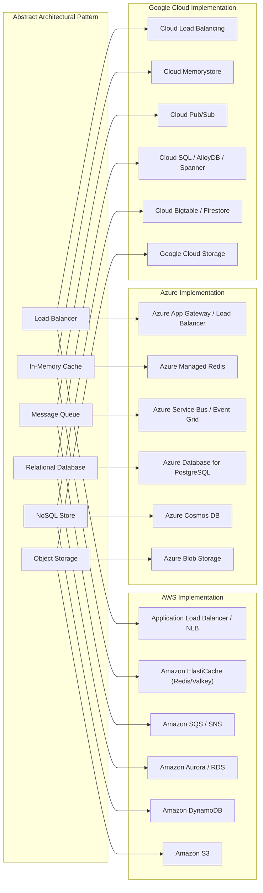

# System Design Quest: Master Implementation Plan
> **Unified Single Source of Truth**  
> Consolidating all architectural roadmaps, gameplay designs, MVP specifications, and future tracks.  
> Clearly divided into **Part I: Already Implemented** and **Part II: Future Roadmap & Unimplemented Tracks**.

---

## Executive Summary & Core Philosophy

### Product Vision
**System Design Quest** transforms system design learning from passive video consumption into an interactive, gamified engineering simulation:
```
Observe Incident ──► Diagnose Bottleneck ──► Deploy Architectural Fix ──► Verify Metrics & Graph ──► Defend Tradeoffs ──► Transfer Pattern ──► Boss Builder ──► Spaced Review
```

### The Cardinal Rule
```
Abstract Pattern First  ──►  Identify Bottleneck  ──►  Deploy Cloud Service / Architecture
```
Learners master foundational distributed systems principles (Horizontal Scaling, Caching, Read Replicas, Queues, Sharding) before being introduced to cloud provider implementations (AWS, Azure, GCP) or advanced infrastructure tracks.

### Action Before Authentication ("No Thinking UX")
Users must never be paralyzed by onboarding forms or complex navigation menus. On their very first visit, they are immediately placed into a production incident, resolve it with interactive decisions, and only then save their progress.

---

## Document Structure & Status Overview



---

# PART I: ALREADY IMPLEMENTED (LIVE IN CODEBASE)

This section documents all features, engines, data models, and UI surfaces that are fully implemented and functional in the active repository.

---

### 1. First-Run "No Thinking" Incident Onboarding (Pushpa Mode)
* **Status**: **SHIPPED & ACTIVE**
* **Primary Files**:
  * [`src/app/page.tsx`](file:///d:/03-React/boaringSD/src/app/page.tsx)
  * [`src/components/PushpaMissionWarRoom.tsx`](file:///d:/03-React/boaringSD/src/components/PushpaMissionWarRoom.tsx)
  * [`src/app/mission/page.tsx`](file:///d:/03-React/boaringSD/src/app/mission/page.tsx)
* **Capabilities**:
  * **Zero Friction Entry**: Unauthenticated users opening `/` bypass marketing fluff and are paged with a live P0 outage: *"The feed is down — 100,000 req/s, 98% CPU, 4,200ms latency, 504 errors"*.
  * **Interactive War Room Simulation**:
    * **Step 1 (Horizontal Scaling)**: App CPU saturated at 98% $\rightarrow$ Deploy Load Balancer and scale stateless application server pool $\rightarrow$ CPU drops to 38%.
    * **Step 2 (Caching)**: Database disk I/O saturated at 95% $\rightarrow$ Deploy in-memory Redis Cache $\rightarrow$ Cache hit rate rises to 92%, DB disk load normalizes.
    * **Step 3 (Read Replicas)**: Read query spike saturates primary database $\rightarrow$ Deploy Read Replicas with read/write splitting $\rightarrow$ Primary DB write latency stabilizes.
  * **Completion & Transition**: Awards +150 XP, unlocks Level 1 on the campaign map, and prompts guest progress retention or demo sign-in.

---

### 2. Playable Incident Schema v2 & War Room Engine
* **Status**: **SHIPPED & ACTIVE**
* **Primary Files**:
  * [`src/types/index.ts`](file:///d:/03-React/boaringSD/src/types/index.ts#L466-L562) (`IncidentV2`, `IncidentGraph`, `IncidentChoice`, `IncidentMetric`, `IncidentPackV2`)
  * [`src/components/incident/IncidentWarRoom.tsx`](file:///d:/03-React/boaringSD/src/components/incident/IncidentWarRoom.tsx)
  * [`src/data/scenarioPacks.ts`](file:///d:/03-React/boaringSD/src/data/scenarioPacks.ts)
  * [`src/data/scenarioPacks/*.json`](file:///d:/03-React/boaringSD/src/data/scenarioPacks/) (15 scenario pack files)
* **Capabilities**:
  * **Data-Driven Incident Runtime**: Incidents load from declarative JSON specifications containing `metricsBefore`, `graphBefore`, interactive choices, and `metricsAfter` / `graphAfter` outcomes.
  * **Dynamic Topology Graphing**: Renders live SVG network topologies connecting `users`, `lb`, `server`, `cache`, `db`, `replica`, `cdn`, `queue`, `worker`, and `gpu` nodes with real-time status tones (`good`, `bad`, `warn`, `neutral`).
  * **Wrong-Answer Physics**: Submitting an incorrect option degrades the system (e.g. CPU spikes to 99%, 504 gateway timeouts worsen, nodes turn red/shake) and provides architectural remediation guidance rather than a static error toast.
  * **15 Incident Scenario Packs**:
    1. `horizontal-scaling.json` (INC-001)
    2. `load-balancing.json` (INC-002)
    3. `read-replicas.json` (INC-003)
    4. `caching.json` (INC-004)
    5. `cdn-edge.json` (INC-005)
    6. `async-queues.json` (INC-006)
    7. `sharding.json` (INC-007)
    8. `consistency.json` (INC-008)
    9. `rate-limiting.json` (INC-009)
    10. `circuit-breaker.json` (INC-010)
    11. `connection-pooling.json` (INC-011)
    12. `backpressure.json` (INC-012)
    13. `idempotency.json` (INC-013)
    14. `multi-region.json` (INC-014)
    15. `health-checks.json` (INC-015)

---

### 3. 15-Level 3-Tier Pattern Campaign & Roadmap
* **Status**: **SHIPPED & ACTIVE**
* **Primary Files**:
  * [`src/app/campaign/page.tsx`](file:///d:/03-React/boaringSD/src/app/campaign/page.tsx)
  * [`src/app/campaign/[chapterId]/page.tsx`](file:///d:/03-React/boaringSD/src/app/campaign/[chapterId]/page.tsx)
  * [`src/data/campaign.ts`](file:///d:/03-React/boaringSD/src/data/campaign.ts)
  * [`src/data/patterns.ts`](file:///d:/03-React/boaringSD/src/data/patterns.ts)
  * [`src/components/PatternMap.tsx`](file:///d:/03-React/boaringSD/src/components/PatternMap.tsx)
* **Curriculum Structure**:
  * **Tier 1: Foundation (Levels 01–05)**
    * `01. Horizontal Scaling`: Stateless server replication, traffic saturation.
    * `02. Load Balancing`: Reverse proxy distribution, health routing algorithms.
    * `03. Read Replicas`: Master-replica replication, read/write splitting.
    * `04. In-Memory Caching`: Cache-aside, cache stampede, sub-5ms lookups.
    * `05. CDN & Edge Delivery`: Static asset offloading, Anycast DNS, edge caching.
  * **Tier 2: Resilience (Levels 06–10)**
    * `06. Asynchronous Queues`: Decoupling ingress bursts, worker fan-out.
    * `07. Database Sharding`: Hash-based partitioning, hotspot mitigations.
    * `08. Distributed Consistency`: CAP theorem, strong vs eventual consistency, quorum reads/writes.
    * `09. Rate Limiting`: Token bucket, leaky bucket, DDoS & API abuse mitigation.
    * `10. Circuit Breakers`: Cascading failure prevention, open/half-open/closed states.
  * **Tier 3: Mastery (Levels 11–15)**
    * `11. Connection Pooling`: PostgreSQL socket limits, TCP handshake reuse.
    * `12. Backpressure & Throttling`: Queue saturation defense, push vs pull flow control.
    * `13. Idempotency & Outbox`: Duplicate payment prevention, transactional outbox pattern.
    * `14. Multi-Region DR`: Cross-continent latency, active-active vs active-passive failover.
    * `15. Health Checks & Eviction`: Deep vs shallow probes, grey failure detection, automated pod eviction.
* **Dual Run Loop in `[chapterId]`**:
  * **Simulation War Room Mode**: Real-time interactive incident triage.
  * **Structured Pattern Run Mode**: 6-stage evidence loop (Observe $\rightarrow$ Diagnose $\rightarrow$ Deploy $\rightarrow$ Tradeoff Counter-Strike $\rightarrow$ Transfer Question $\rightarrow$ Spaced Review Post-Mortem).

---

### 4. Interactive Architecture Builder & Scenario Boss Loop
* **Status**: **SHIPPED & ACTIVE**
* **Primary Files**:
  * [`src/app/builder/page.tsx`](file:///d:/03-React/boaringSD/src/app/builder/page.tsx)
  * [`src/lib/builderScore.ts`](file:///d:/03-React/boaringSD/src/lib/builderScore.ts)
  * [`src/data/builderScenarios.ts`](file:///d:/03-React/boaringSD/src/data/builderScenarios.ts)
  * [`src/components/builder/CustomNodes.tsx`](file:///d:/03-React/boaringSD/src/components/builder/CustomNodes.tsx)
* **Capabilities**:
  * **React Flow Canvas**: Drag-and-drop design surface supporting Clients, Load Balancers, Servers, Caches, Databases, Read Replicas, CDNs, and Queues.
  * **Live Traffic Stress Simulation**: Slider injecting 1,000 to 50,000 req/s into the visual topology, calculating node CPU, queue backpressure, cache hits, and latency bottlenecks.
  * **Scenario Boss Mode (`/builder?scenario=<id>`)**: Launches predefined broken systems with concrete traffic parameters, required components, and win criteria.
  * **Single Scoring Authority**: `evaluateArchitectureScore()` calculates performance scores (0–100), provides structural and performance feedback, and enforces the pass/fail threshold.

---

### 5. System Design Interview Arena (MVP)
* **Status**: **SHIPPED & ACTIVE**
* **Primary Files**:
  * [`src/app/interview/page.tsx`](file:///d:/03-React/boaringSD/src/app/interview/page.tsx)
  * [`src/data/interview.ts`](file:///d:/03-React/boaringSD/src/data/interview.ts)
* **Capabilities**:
  * **Timed Mock Interview Rounds**: Real-world interview countdowns with strict constraints on scale, latency, and durability.
  * **Interactive Component Assembly**: Toggle edge CDNs, reverse proxies, server counts, caches, queues, databases, and read replicas.
  * **Real-Time Rubric Evaluation**: Immediate architectural scoring with explicit feedback on single points of failure (SPOFs) and resource saturation.
  * **Multi-Stage Interviewer Follow-Ups**: Deep dive oral/quiz questions testing edge cases, race conditions, and staff-level tradeoff defenses.
  * **Implemented Scenarios**:
    1. **Tier 1 (Beginner)**: *Design URL Shortener (TinyURL)* (100:1 read ratio, Base62 counter ranges, 301 vs 302 redirects).
    2. **Tier 2 (Intermediate)**: *Design Twitter Feed (Timeline & Fanout)* (Fanout-on-write push vs pull, celebrity hotkey solutions).
    3. **Tier 3 (Advanced)**: *Design Uber (Geospatial Ride Dispatch)* (1.25M GPS pings/sec, Redis Geo / QuadTree / S2 cells, double-dispatch mutual exclusion).
    4. **Tier 4 (Staff)**: *Design Global E-Commerce (Amazon Prime Day)* (500K catalog RPS, Lua atomic flash inventory lease, transactional outbox).

---

### 6. Progression, Evidence Model & Local Persistence
* **Status**: **SHIPPED & ACTIVE**
* **Primary Files**:
  * [`src/lib/progression.ts`](file:///d:/03-React/boaringSD/src/lib/progression.ts)
  * [`src/lib/storage.ts`](file:///d:/03-React/boaringSD/src/lib/storage.ts)
  * [`src/lib/useUserStats.ts`](file:///d:/03-React/boaringSD/src/lib/useUserStats.ts)
  * [`src/lib/*.test.ts`](file:///d:/03-React/boaringSD/src/lib/)
* **Capabilities**:
  * **Honest Evidence Model**: Replaces superficial percentage progress with verified mastery states:  
    `Unseen ──► Introduced ──► Applied Once ──► Passed Transfer ──► Reliable ──► Needs Review`
  * **Reliability Gate**: A pattern can only achieve `Reliable` after passing the pattern run, a transfer question, an architecture builder boss, and a subsequent spaced review (1, 3, 7, 30 days).
  * **Pure Progression Functions**: Next-action recommendation (`selectNextAction()`), daily streak calculation, level thresholds, and XP award idempotency.
  * **LocalStorage v1 $\rightarrow$ v2 Migration**: Versioned browser persistence with automatic fallback guards.

---

### 7. Auxiliary Labs & Legacy Modules
* **Status**: **MAINTAINED IN LABS**
* **Primary Files**:
  * [`src/app/evolution/page.tsx`](file:///d:/03-React/boaringSD/src/app/evolution/page.tsx): 5-stage evolutionary scaling simulation (1 user $\rightarrow$ 10M users).
  * [`src/app/guided/page.tsx`](file:///d:/03-React/boaringSD/src/app/guided/page.tsx): Guided thinking mode (Requirements $\rightarrow$ Entities $\rightarrow$ APIs $\rightarrow$ Architecture).
  * [`src/app/learn/[lessonId]/page.tsx`](file:///d:/03-React/boaringSD/src/app/learn/[lessonId]/page.tsx): Foundational interactive concept lessons.
  * [`src/app/dashboard/page.tsx`](file:///d:/03-React/boaringSD/src/app/dashboard/page.tsx): Learner profile, rank title, XP breakdown, badges, and next mission CTA.

---

# PART II: FUTURE ROADMAP & UNIMPLEMENTED TRACKS

This section details all planned enhancements, technical refactors, and advanced curriculum tracks structured into prioritized implementation phases.

---

## Phase 1: Authentication, Real Database Sync & Route Consolidation
> **Priority: High | Focus: Technical Debt, Platform Reliability & Clean UX**

### 1.1 True Cross-Device Persistence (Prisma + PostgreSQL + NextAuth)
* **Current Limitation**: User progress lives only in browser `localStorage`. The current [`src/app/api/progress/route.ts`](file:///d:/03-React/boaringSD/src/app/api/progress/route.ts) writes all data to a single hardcoded demo user and does not sync cross-device.
* **Implementation Plan**:
  1. Update `prisma/schema.prisma` to store the Pattern Mastery Evidence model (`PatternEvidence`, `awardedEvents`, `practiceDays`, `streakDays`, `scenarioRotation`).
  2. Implement NextAuth with Google and GitHub OAuth providers.
  3. Create bi-directional sync on sign-in: merge unauthenticated guest progress into the authenticated user account without data loss.

### 1.2 Route & Navigation Cleanup
* **Current Limitation**: Redundant and orphaned routes clutter the navigation ([notes.md](file:///d:/03-React/boaringSD/notes.md)).
* **Implementation Plan**:
  1. Remove or redirect orphaned `/challenge/[challengeId]` routes to the corresponding level on `/campaign/[chapterId]`.
  2. Embed `/learn/[lessonId]` as a contextual *"Read Concept Deep-Dive"* drawer/modal inside the level run rather than a standalone disconnected page.
  3. Streamline Navbar into two distinct groupings:
     * **Core Quest**: Next Incident $\rightarrow$ 15-Level Map $\rightarrow$ Review Queue.
     * **Engineering Labs**: Architecture Builder Sandbox + Interview Arena.
  4. Update `README.md` to accurately document the 15-level pattern game, incident war rooms, and interview arena.

---

## Phase 2: Expanded Real-World Problem Catalog (V3 Scenarios)
> **Priority: High | Focus: Domain-Specific Distributed Systems**

Expand beyond the 4 existing interview problems to create reusable, dynamic scenario simulations across iconic internet architectures:

| Domain | Systems & Challenges | Core Architectural Focus |
| :--- | :--- | :--- |
| **Messaging & Chat** | • WhatsApp<br>• Discord Guilds<br>• Slack Workspace | Persistent WebSockets, message sequencing, push notification fanout, offline message store, delivery receipts. |
| **Content & Streaming** | • YouTube Video Ingestion<br>• Netflix Streaming<br>• Spotify Audio | Chunked video transcoding pipelines, adaptive bitrate streaming (HLS/DASH), origin shield caching, CDN egress optimization. |
| **Utility & Storage** | • Pastebin<br>• Google Drive Sync<br>• Dropbox File Block Store | Hash collision handling, chunked multipart uploads, content deduplication, metadata consistency. |
| **Fintech & Transacting** | • Stripe Payment Gateway<br>• Flash-Sale Inventory Engine<br>• Stock Trading Order Book | Distributed transactions (Saga / 2PC), idempotency keys, atomic balance checks, write-ahead logging (WAL). |
| **Real-Time Geospatial** | • Google Maps Route Finding<br>• Food Delivery Tracking (Doordash) | Graph traversal (A* / Dijkstra), driver clustering, push ETA estimation, geospatial fencing. |

---

## Phase 3: Cloud Service Application Layer (V4 Multi-Cloud)
> **Priority: Medium-High | Focus: Pattern-to-Cloud Service Mapping**

Bridge abstract computer science patterns with concrete public cloud services (AWS, Azure, GCP).

### 3.1 Cloud Service Mapping Matrix



### 3.2 Dynamic Cloud Configuration Panel
* **Service Sizing & Topology Configuration**: Learners select cluster sizes, read replica counts, multi-AZ deployment zones, and cache eviction policies.
* **Shared Responsibility Visualization**: Highlights what the managed cloud service handles (auto-patching, disk replication) vs what the engineer must configure (indexes, pool sizes, circuit breakers).
* **Cloud Cost Estimator**: Calculates real-time estimated monthly billing for compute instances, IOPS, managed storage tiers, and cross-AZ/cross-region network egress.

---

## Phase 4: Production Cloud Architecture Missions (V5)
> **Priority: Medium | Focus: End-to-End Concrete Cloud Deployments**

* **Mission 1: Multi-Region High-Throughput Cache**
  * *Scale*: 100,000 RPS, <50ms global latency.
  * *Challenges*: Multi-region cache synchronization, cache stampede / thundering herd mitigation, cross-region replication lag, regional failover without cache cold starts.
* **Mission 2: Global Content Delivery & Edge Invalidation**
  * *Scale*: Petabyte-scale static and media asset distribution.
  * *Challenges*: Edge TTL tuning, origin shield caching, surrogate key purge invalidation, egress bandwidth cost reduction.
* **Mission 3: High-Volume Asynchronous Processing**
  * *Scale*: 1,000,000 background jobs per hour.
  * *Challenges*: Queue depth monitoring, worker autoscaling policies, backpressure handling, dead-letter queues (DLQ), idempotent worker retries.
* **Mission 4: Database Scaling & High Availability**
  * *Scale*: 10,000,000 registered users, 80:20 read-to-write ratio.
  * *Challenges*: Connection pooling (PgBouncer), read replica lag mitigation, automated primary failover, horizontal table sharding.

---

## Phase 5: Tradeoff Simulator (V6) & Vendor Portability (V7)
> **Priority: Medium | Focus: Senior Engineering Decision-Making**

### 5.1 Tradeoff Simulator (V6)
Structured decision-making scenarios where every choice incurs engineering tradeoffs:
1. **Cost vs Performance**: Provisioning peak hardware vs autoscaling with warm-up latency.
2. **Consistency vs Availability (CAP / PACELC)**: Strong linearizable consistency vs eventual consistency under network partition.
3. **Single-Region vs Multi-Region**: Operational simplicity vs geographic disaster tolerance and cross-region replication costs.
4. **SQL vs NoSQL**: Relational ACID integrity and multi-table joins vs horizontal partitioning and schema flexibility.
5. **Read vs Write Optimization**: CQRS, write-heavy LSM trees (Cassandra/RocksDB) vs read-optimized B-trees.

### 5.2 Vendor Lock-In & Portability Simulator (V7)
* **Cloud Migration Challenges**:
  * AWS to Azure: Migrating DynamoDB $\rightarrow$ Cosmos DB and SQS $\rightarrow$ Azure Service Bus.
  * Azure to GCP: Migrating Blob Storage $\rightarrow$ Google Cloud Storage and Azure SQL $\rightarrow$ Cloud Spanner.
* **Multi-Cloud Hybrid Failover**: Configuring active-active workloads across two cloud providers while avoiding cross-cloud egress cost traps.
* **Portability Scoring Engine**: Analyzes architecture topologies and assigns a Portability Score (0–100%) by detecting proprietary SDK dependencies (e.g. AWS AppSync, Step Functions) vs open standards (PostgreSQL wire protocol, Redis protocol, Docker/K8s).

---

## Phase 6: Chaos Engineering & Live Outage Track (V8)
> **Priority: Medium | Focus: Resilience & Incident Response Under Pressure**

* **Live Failure Injection Engine**:
  * **Traffic Spikes**: Sudden 10x–50x traffic surge during breaking news or flash sales.
  * **Compute Failures**: Random server crashes, memory leaks, and CPU throttling.
  * **Network Chaos**: Elevated packet loss, inter-service latency spikes, and cross-AZ partitions.
  * **Storage Degradation**: Database disk IOPS exhaustion, replica replication lag, and cache eviction storms.
  * **Dependency Failures**: Third-party payment gateway timeouts and DNS resolution failures.
* **Incident Command War Room**:
  * Live outage clock with active SLA error budget burn-down.
  * On-call runbooks: Learners toggle rate limiting, scale fleets, isolate failing zones, and shed load to save the system.

---

## Phase 7: Observability (V9) & Security Engineering (V10)
> **Priority: Low-Medium | Focus: Production Telemetry & Threat Defense**

### 7.1 Observability & Telemetry Track (V9)
* **The Telemetry Triad**:
  * **Metrics**: CPU, memory, RPS, p50/p95/p99 latency histograms, error rates (RED method).
  * **Structured Logs**: Correlated request IDs across distributed microservices.
  * **Distributed Tracing**: OpenTelemetry flame graphs highlighting downstream service latency bottlenecks.
* **Root Cause Analysis Challenges**: Learners inspect metrics dashboards and trace graphs to diagnose misconfigured connection pools, slow SQL queries, and upstream network timeouts.

### 7.2 Security Engineering Track (V10)
* **Authentication & Authorization**: OAuth 2.0 / OIDC flows, JWT validation, and RBAC / ABAC policies.
* **Rate Limiting & Abuse Protection**: IP-based throttling, API key quotas, and bot mitigation.
* **Secrets Management & Encryption**: HashiCorp Vault / AWS Secrets Manager, TLS in transit, and envelope encryption with KMS.
* **Edge Defense**: Web Application Firewall (WAF) rule configuration against SQL injection, cross-site scripting (XSS), and Layer 7 HTTP floods.
* **Multi-Tenant Isolation**: Row-Level Security (RLS) vs schema-per-tenant vs database-per-tenant models.

---

## Phase 8: SRE Reliability Operations (V11) & Interview Arena Expansion (V12)
> **Priority: Low-Medium | Focus: Operational Rigor & Interview Mastery**

### 8.1 SRE & Reliability Operations (V11)
* **Service Level Objectives (SLOs) & Error Budgets**: Defining 99.9% vs 99.99% availability targets and calculating allowable downtime per month.
* **Error Budget Burn Rate Alerts**: Distinguishing slow burns from rapid outages requiring immediate paging.
* **Blameless Post-Mortem Generator**: Interactive incident retrospectives compiling timeline of events, root cause analysis, and preventative action items.

### 8.2 System Design Interview Arena Expansion (V12)
* **Expanded Problem Library**: Covering 15+ canonical interview problems.
* **Simulated Interviewer Grilling Engine**: Dynamic follow-up questions challenging learner designs on cost, scale, and failure resilience.
* **Comprehensive Scoring Rubric**: Automated grading based on FAANG interview standards across Functional Requirements, Non-Functional Requirements, Architecture Diagram, and Deep Dive Defense.

---

## Phase 9: Engineering Career Paths & Skill Diagnostic Engine (V13)
> **Priority: Low | Focus: Career Progression & Gap Analysis**

* **Role-Based Engineering Roadmaps**:
  * **Junior SDE (L3)**: Core fundamentals (HTTP, Caching, Load Balancing, Basic CRUD).
  * **Mid-Level SDE (L4)**: System reliability (Replication, Queues, Rate Limiting, Connection Pools).
  * **Senior SDE (L5)**: Distributed architecture (Sharding, Consistency models, Multi-Region, Chaos tolerance).
  * **Staff / Principal Architect (L6+)**: Tradeoffs, multi-cloud strategy, cost optimization, vendor portability, and organizational technical leadership.
* **Diagnostic Skill Radar**: Visual radar chart highlighting strengths and knowledge gaps across 12 distributed systems competencies.
* **Personalized Curriculum Generator**: Customized study paths targeting upcoming interview dates or role promotions.

---

# PART III: PLAN CONSOLIDATION & CLEANUP AUDIT

To eliminate documentation fragmentation and guarantee that this master document serves as the **single source of truth**, all previously scattered plan files were merged into this document and removed from the repository:

| Historical / Retired Plan File | Status | Consolidated Mapping |
| :--- | :--- | :--- |
| `Instruction.md` | **Removed (Superseded)** | Foundational vision & MVP features integrated into **Part I (Sections 1–4)** and Tech Stack. |
| `MVP_ENHANCEMENTS.md` | **Removed (Superseded)** | Guided thinking, interactive feedback, and scenario ideas integrated into **Part I (Section 5 & 7)** and **Part II (Phase 2)**. |
| `NO_THINKING_UX_PRINCIPLES.md` | **Removed (Superseded)** | Action Before Authentication & first-run incident flow integrated into **Part I (Section 1)**. |
| `PUSHPA_MODE_ONBOARDING.md` | **Removed (Superseded)** | Incident onboarding flow and war room mechanics integrated into **Part I (Section 1)**. |
| `patternMasteryGame.md` | **Removed (Superseded)** | 15-level pattern loop, evidence progression model, and builder scoring integrated into **Part I (Sections 2, 3, 4, 6)**. |
| `cloud_master_plan.md` | **Removed (Superseded)** | Phases V3–V13 multi-cloud tracks, mission specs, and life cycle integrated into **Part II (Phases 2–9)**. |
| `notes.md` | **Removed (Integrated)** | Reviewer gaps (auth, sync, route pruning, content depth) addressed in **Part II (Phase 1)**. |

> [!NOTE]
> All future engineering, architectural decisions, and feature development must reference and update this document: [MASTER_IMPLEMENTATION_PLAN.md](file:///D:/03-React/boaringSD/MASTER_IMPLEMENTATION_PLAN.md).
