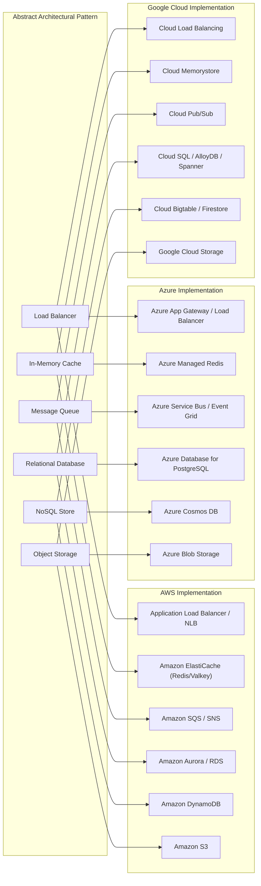

# System Design Quest: Master Implementation Plan
> **Unified Single Source of Truth**  
> Consolidating all architectural roadmaps, gameplay designs, MVP specifications, and future tracks.  
> Clearly divided into **Part I: Already Implemented** and **Part II: Future Roadmap & Unimplemented Tracks**.  
> Detailed work plans live in [`docs/fix-plan-v2.md`](docs/fix-plan-v2.md) (answer integrity, stakes, content) and [`docs/retention-plan.md`](docs/retention-plan.md) (daily return). This document records what the code actually does.

---

## Executive Summary & Core Philosophy

### Product Vision & Single Core Motive
> **"One who comes to the website learns system design without being bored. He not only plays a game, but actually learns the concepts deeply."**

**BoaringSD** transforms system design learning from passive textbook reading into an indispensable, tactical engineering flight simulator:
```
Outage Fire ──► Concept Intel (ELI5 Analogy) ──► Architectural Deploy ──► Tradeoff Ledger ──► Second-Order Cascade ──► FAANG Post-Mortem ──► Boss Builder
```

### The 6 Unified Product Pillars
1. **Just-In-Time Concept Intel**: 30-second ELI5 analogies, a 3-step dataflow and "when it fails" for all 23 patterns, plus tap-to-define glossary tooltips on jargon in answer labels.
2. **Every Replay Is a Surprise**: incident rotation, procedural skins (traffic scale, region, occasion), constraint variants that change the correct answer, curveballs and cascades, so no two runs are identical while mastering that level's core pattern.
3. **Tactical War Room & Telemetry Inspector**: click topology nodes to read their logs (authored clues on "find the culprit" incidents), and tune live knobs on "tune the knob" incidents.
4. **FAANG Interview Arena**: requirements scoping and distractor traps → back-of-the-envelope capacity math → high-level architecture on a canvas → staff deep dive and concurrency defense.
5. **Architectural Tradeoff Cards & SRE Defense Gates**: each choice carries monthly cloud cost (Δ), latency impact, operational complexity (1–5) and consistency guarantee; the approach rating is revealed only after deploying.
6. **6-Axis Engineering Competency Mastery Radar**: measured competency across *Bottleneck Diagnosis, Pattern Selection, Capacity Estimation, Tradeoff Defense, End-to-End Design, and Resilience & Recovery*.

### The Cardinal Rule
```
Abstract Pattern First  ──►  Identify Bottleneck  ──►  Defend Tradeoff & Scale  ──►  Deploy Cloud Service
```
Learners master foundational distributed systems principles (Horizontal Scaling, Caching, Read Replicas, Queues, Sharding) before being introduced to cloud provider implementations (AWS, Azure, GCP) or advanced infrastructure tracks.

### Action Before Authentication ("No Thinking UX")
Users must never be paralyzed by onboarding forms or complex navigation menus. On their very first visit, they are immediately placed into a production incident, resolve it with interactive decisions, and only then save their progress.

### Gameplay-First Guardrails
Every screen must feel like a game mechanic, not homework: one decision every 20–40 seconds, at most ~120 words to read before an action, never two text-entry steps in a row, instant feedback on every correct action, runs of 5 minutes or less, no mandatory step without a reward, and replays that feel different, not just look different.

---

## Honest Status (updated 2026-09-29)
> History: the original self-score (9.3/10) was not backed by the code. A learner-eyes review on 2026-09-26 scored the app about **4.5/10**. After the first quality pass, a second review on 2026-09-27 scored about **5.5/10**: you could win by reading the approach badges and picking the longest answer, and every level was the same 3-click loop. Since then most of `docs/fix-plan-v2.md` and the retention build order have shipped. No new learner evaluation has been run yet. This table is checked against the code, not against earlier documents. Checks at this revision: `npm test` 263/263 passing, `npx tsc --noEmit` clean, `npx eslint src` 0 errors (28 pre-existing warnings).

| Area | Status | Notes |
| :--- | :--- | :--- |
| Answer integrity | **Live** | Options are shuffled per attempt (`src/lib/shuffle.ts`). Approach badges are hidden until after deploy (`src/lib/choiceChips.ts`). Option lengths are linted across all 5 question sources (`src/lib/optionLint.ts`): the correct answer is the longest in 23–32% of questions, with an average length ratio of about 1.0×. |
| Scenario content | **Live** | 513 incidents in 23 packs (17–27 per level), all passing the content gate (`src/data/incidentQuality.ts`), which includes answer-is-longest, length-spread, strawman-distractor and always-wrong-trope checks. The build fails on any gate issue. Gap: canonical and cascade incidents are fetched at runtime without a gate check (only the test protects them). |
| Stakes | **Live** | Error budget (about 1% per 5 s of reading, 15% per wrong deploy; a SEV-0 post-mortem at 0% with an instant restart), a cloud-credit wallet that costs a star when overspent, and a combo multiplier saved across levels (`src/lib/runEconomy.ts`). Gap: run stars are shown but not saved. |
| Consequences | **Live** | All 922 wrong choices change the graph. Every level has a band-aid that "holds" and then pages the real problem, and every pack has cascades, resolved with a "Handle it now / Log a ticket" choice instead of a countdown. |
| Formats | **Live** | All 6 planned formats: pick, find the culprit (20, all with authored logs), tune the knob (15), two-step (12), spot the bad PR (23) and budget cut (23). The first-run rhythm rule holds (at least 4 formats, none more than 3 levels in a row). |
| Replay variety | **Live** | Rotation plus skins, 69 constraint variants (3 per pack, each flipping the correct answer, with rewritten outcomes and hints, enforced by `src/lib/incidentSkin.test.ts`), and 4 rotating Aftershock questions per pattern. Gap: the Defense modal has no rotating pool (load-balancing has 1 option). |
| Just-in-time teaching | **Live** | Concept Intel for all 23 patterns (≤80 words for the core fields), glossary tooltips, and the pattern's what-failed / why-it-worked / insufficient-when cards in the War Room debrief. |
| Transfer check | **Live** | The "Aftershock" closes every War Room level; only a first-try pass counts as transfer evidence. |
| Free-text reasoning | **Live** | "Defend your call" (≤280 chars) graded by an LLM against a server-side rubric (`/api/grade`, Gemini provider). The self-assessment fallback pays half, never counts toward Reliable, and has you tick the rubric before the model answer is shown. |
| Progress evidence | **Live** | Run results record real first-try and hint data, builder hints are recorded, and the builder counts toward Reliable only with a first-try explanation. The radar shows "Scouting" until an axis has 3+ attempts. |
| Streaks & ranks | **Live** | The streak counts only real progress (a failed estimate, reasoning answer or review, a lesson or an interview don't count). Freezes are earned every 7 days (max 2), plus milestone badges at 3/7/30/100 days. XP ranks grow progressively, and side modes have daily XP caps. |
| Daily outage | **Live** | `/daily`: one outage for everyone per UTC day, walking through the constraint variants without repeats; +75 XP bonus and a share card (`src/lib/daily.ts`). |
| Weekly boss | **Live** | `/journey` Scale Journey: 5 stages on one carried-over design, a weekly twist, +150 XP; calibrated against the simulator by test (`src/data/scaleJourney.test.ts`). Replaced the Evolution slideshow. |
| Builder grading | **Live** | Simulation follows the wiring; budgets and unneeded-component penalties stop "place everything"; 16 node types, and most bosses fail without their pattern's node. Each attempt has a stated priority (cost, latency or resilience) that costs a star when missed. After a pass, the design is compared with the lean reference. Gaps: the idempotency boss still passes with only a cache; the `isIdempotencyStore` and `clusterSize` properties are unused; 13 of 23 bosses start from the same `lbStack(3)`. |
| Interview arena | **Live** | 10 problems. The design stage is a canvas where only components wired on a path from the client count, and the scorecard compares it with the staff benchmark. Gap: estimation targets are fixed numbers (no per-attempt randomisation). |
| Estimation | **Partial** | One ratio-based scorer (`src/lib/estimation.ts`) for the gym and the interview. 9 templates cover 8 categories, but the gym still uses one fixed generated set (seed 2026), so only the order changes between sessions. |
| Telemetry inspector | **Partial** | "Inspect logs" nodes come from the incident's own graph. Authored logs exist only for the 20 culprit incidents; the rest show role-generic logs. |
| Product analytics | **Live (local)** | An anonymous event ring buffer (`src/lib/events.ts`), sent with `sendBeacon` only if `NEXT_PUBLIC_EVENTS_URL` is set. `summarizeEvents()` computes the retention metrics. There is no collector yet. |
| Accounts / sync | **Not built** | Progress is local to the browser. |
| Social / leaderboard | **Not built** | Deferred until accounts exist; the daily share card covers sharing for now. |
| Coverage | **Growing** | 23 levels in 5 tiers (Foundation, Resilience, Mastery, Depth, Operate), 23 builder bosses, 16 case studies, trade-off defense sets for all 23 patterns. Consistent hashing, API design, data modeling, blob storage and geo-indexing each have one incident inside an existing pack. |

---

## Document Structure & Status Overview


```mermaid
graph TD
    subgraph Part1["PART I: ALREADY IMPLEMENTED (LIVE IN CODEBASE)"]
        A1["1. First-Run Incident Onboarding (Pushpa Mode)"]
        A2["2. War Room Engine: Stakes, Formats, Consequences & Variants"]
        A3["3. 23-Level 5-Tier Pattern Campaign"]
        A4["4. Architecture Builder & Boss Battles"]
        A5["5. FAANG Mock Interview Arena"]
        A6["6. 6-Axis Engineering Competency Mastery Radar"]
        A7["7. Progression, Streaks, Evidence Model & Local Persistence"]
        A8["8. Auxiliary Labs & Estimation Gym"]
        A9["9. Daily Outage"]
        A10["10. Scale Journey Weekly Boss"]
        A11["11. Product Events"]
    end

    subgraph Part2["PART II: FUTURE ROADMAP (PLANNED / BACKLOG)"]
        F0["Phase 0: Open Items from Fix Plan v2 & Retention Plan"]
        F1["Phase 1: Auth, Real Database Sync & Route Consolidation"]
        F2["Phase 2: Expanded Real-World Problem Catalog (V3)"]
        F3["Phase 3: Cloud Service Application Layer (V4 Multi-Cloud)"]
        F4["Phase 4: Production Cloud Architecture Missions (V5)"]
        F5["Phase 5: Tradeoff & Vendor Lock-In Simulators (V6 & V7)"]
        F6["Phase 6: Chaos Engineering & Live Outage Track (V8)"]
        F7["Phase 7: Observability & Security Tracks (V9 & V10)"]
        F8["Phase 8: SRE Reliability & AI Interview Grilling (V11 & V12)"]
        F9["Phase 9: Enterprise Career Paths & Diagnostic Engine (V13)"]
    end

    Part1 -->|Natural Evolution| Part2
```

---

# PART I: ALREADY IMPLEMENTED (LIVE IN CODEBASE)

This section documents all features, engines, data models, and UI surfaces that are implemented and functional in the active repository, with known gaps noted where they exist.

---

### 1. First-Run "No Thinking" Incident Onboarding (Pushpa Mode)
* **Status**: **Live**. `/mission` redirects to `/`.
* **Primary Files**:
  * [`src/app/page.tsx`](file:///d:/03-React/boaringSD/src/app/page.tsx)
  * [`src/components/PushpaMissionWarRoom.tsx`](file:///d:/03-React/boaringSD/src/components/PushpaMissionWarRoom.tsx)
  * [`src/components/simulation/SystemFlightSim.tsx`](file:///d:/03-React/boaringSD/src/components/simulation/SystemFlightSim.tsx)
* **Capabilities**:
  * **Zero Friction Entry**: Unauthenticated users opening `/` are paged with a live P0 outage: *"The feed is down — 100,000 req/s, 98% CPU, 4,200ms latency, 504 errors"*.
  * **Incident 1 (`hs-01`)**: App CPU saturated at 98% under 100,000 req/s → deploy a stateless server fleet → CPU normalizes.
  * **Incident 2 (`lb-01`)**: Server 1 overloaded at 90% while others idle → deploy a load balancer → traffic balanced.
  * **Flight-sim fixes are graded honestly**: the fix buttons carry no answer chips; a band-aid only buys time, "Upgrade to 64 cores" is over budget and earns 1 star, and the victory copy matches the chosen fix (`src/lib/flightSimFix.ts`).
  * **Completion & Transition**: Fulfills `hasFinishedOnboarding()`, awards XP, unlocks Level 1, and turns `/` into the returning-player home: one next action plus the Daily Outage and (once unlocked) the Scale Journey cards.

---

### 2. Playable Incident Schema v2 & War Room Engine
* **Status**: **Live**. Gaps: two planned formats ("Spot the bad PR", "Budget cut") are not built; 90% of incidents are still pick-the-fix; run stars are not saved.
* **Primary Files**:
  * [`src/types/index.ts`](file:///d:/03-React/boaringSD/src/types/index.ts) (`IncidentV2`, `IncidentChoice`, `GraphPatch`, `IncidentConstraintVariant`, `CulpritSpec`, `KnobSpec`)
  * [`src/components/incident/IncidentWarRoom.tsx`](file:///d:/03-React/boaringSD/src/components/incident/IncidentWarRoom.tsx), `ChoiceCards.tsx`, `CulpritPanel.tsx`, `KnobPanel.tsx`, `RunHud.tsx`, `BreachScreen.tsx`, `ArchitecturalDefenseModal.tsx`, `ConceptIntelDrawer.tsx`
  * [`src/lib/runEconomy.ts`](file:///d:/03-React/boaringSD/src/lib/runEconomy.ts), [`src/lib/incidentSkin.ts`](file:///d:/03-React/boaringSD/src/lib/incidentSkin.ts), [`src/lib/graphPatch.ts`](file:///d:/03-React/boaringSD/src/lib/graphPatch.ts), [`src/lib/choiceChips.ts`](file:///d:/03-React/boaringSD/src/lib/choiceChips.ts), [`src/lib/defenseQuestions.ts`](file:///d:/03-React/boaringSD/src/lib/defenseQuestions.ts)
  * [`src/data/scenarioPacks/*.json`](file:///d:/03-React/boaringSD/src/data/scenarioPacks/) (23 packs), [`src/data/incidentQuality.ts`](file:///d:/03-React/boaringSD/src/data/incidentQuality.ts), [`src/data/tradeoffScenarios.ts`](file:///d:/03-React/boaringSD/src/data/tradeoffScenarios.ts), [`src/data/transferPools.ts`](file:///d:/03-React/boaringSD/src/data/transferPools.ts), [`src/data/conceptIntel.ts`](file:///d:/03-React/boaringSD/src/data/conceptIntel.ts), [`src/data/glossary.ts`](file:///d:/03-React/boaringSD/src/data/glossary.ts)
* **Capabilities**:
  * **Data-Driven Incident Runtime**: incidents load from JSON with `metricsBefore`, `graphBefore`, three choices, and per-choice outcomes (`metricsAfter`, `graphAfter` or `graphPatch`, result text, trade-off vector).
  * **23 Incident Scenario Packs, 462 incidents**: one pack per level, from `horizontal-scaling.json` to `auth-at-scale.json`, 15–25 incidents each, all passing the content gate.
  * **Blind choices**: the "Optimal / Viable / Anti-Pattern" rating appears only after deploy, as the senior engineer's rating in the trade-off ledger.
  * **Stakes**: error budget with SEV-0 breach screen and instant restart; credit wallet from each choice's `costMonthlyDelta`; roll back and retry costs 5% of budget; combo multiplier (×1 to ×3) that a wrong deploy or hint breaks with a sound.
  * **Wrong-Answer Physics**: every wrong choice patches the topology (a node goes red, a hot spot appears, a queue backs up). Band-aids "hold" and then page the real problem (`consequenceIncidentId`).
  * **Second-Order Cascades**: correct fixes can create a smaller follow-up incident; the player chooses "Handle it now (+XP, keep combo)" or "Log a ticket (−1 star)".
  * **Formats**: pick the fix, find the culprit (flag the failing node from its logs before choices appear), tune the knob (slider with live metrics), two-step (mitigate, then fix the root cause).
  * **Constraint variants**: 69 variants (3 per pack) change a business constraint so that a different option becomes correct, with rewritten outcomes, hints and graph physics. Variants keep their authored traffic numbers, and the War Room labels the constraint "(changed)".
  * **SRE Architectural Defense Gate**: trade-off sets exist for all 23 patterns. Questions name the option the player actually deployed and are shuffled per attempt; scored on the first attempt.
  * **Debrief**: shows the XP actually awarded ("Replay XP resets tomorrow" on a same-day replay), "Mastery Verified" only on a first-try Aftershock, and the pattern's what-failed / why-it-worked / insufficient-when cards.

---

### 3. 23-Level 5-Tier Pattern Campaign & Roadmap
* **Status**: **Live**. Guided study mode is `?mode=study` (`?mode=guided` still accepted); spaced review is `?mode=review`.
* **Primary Files**:
  * [`src/app/campaign/page.tsx`](file:///d:/03-React/boaringSD/src/app/campaign/page.tsx)
  * [`src/app/campaign/[chapterId]/page.tsx`](file:///d:/03-React/boaringSD/src/app/campaign/[chapterId]/page.tsx)
  * [`src/data/campaign.ts`](file:///d:/03-React/boaringSD/src/data/campaign.ts)
  * [`src/data/patterns.ts`](file:///d:/03-React/boaringSD/src/data/patterns.ts)
  * [`src/components/PatternMap.tsx`](file:///d:/03-React/boaringSD/src/components/PatternMap.tsx)
* **Curriculum Structure**:
  * **Tier 1: Foundation (Levels 01–05)**: Horizontal Scaling, Load Balancing, Read Replicas, In-Memory Caching, CDN & Edge Delivery.
  * **Tier 2: Resilience (Levels 06–10)**: Asynchronous Queues, Database Sharding, Distributed Consistency, Rate Limiting, Circuit Breakers.
  * **Tier 3: Mastery (Levels 11–15)**: Connection Pooling, Backpressure & Throttling, Idempotency & Outbox, Multi-Region DR, Health Checks & Eviction.
  * **Tier 4: Depth (Levels 16–18)**: CAP & PACELC, Consensus & Quorums, Storage Engines & Indexing.
  * **Tier 5: Operate (Levels 19–23)**: ID Generation, Search & Inverted Indexes, Streams & Event Processing, Observability & SLOs, Auth at Scale.
* **Run Modes in `[chapterId]`**:
  * **War Room** (default): real-time incident triage, ending with the Aftershock and an optional "Defend your call".
  * **Kinetic Sim** (Levels 1–2): the flight simulator; a clear credits both levels.
  * **Guided study** (`?mode=study`): 6-stage evidence loop (Observe → Diagnose → Deploy → Tradeoff Counter-Strike → Transfer Question → Post-Mortem).
  * First clears of Levels 1 and 2 start with a non-tutorial incident (`hs-02`, `lb-02`), since the player just played `hs-01` and `lb-01`.

---

### 4. Interactive Architecture Builder & Boss Battles
* **Status**: **Live**. Gaps: the idempotency boss passes with only a cache; `isIdempotencyStore` and `clusterSize` are declared but unused; 13 of 23 bosses start from `lbStack(3)`.
* **Primary Files**:
  * [`src/app/builder/page.tsx`](file:///d:/03-React/boaringSD/src/app/builder/page.tsx)
  * [`src/lib/builderScore.ts`](file:///d:/03-React/boaringSD/src/lib/builderScore.ts), [`src/lib/designPriority.ts`](file:///d:/03-React/boaringSD/src/lib/designPriority.ts), [`src/lib/designCompare.ts`](file:///d:/03-React/boaringSD/src/lib/designCompare.ts), [`src/lib/builderExplain.ts`](file:///d:/03-React/boaringSD/src/lib/builderExplain.ts)
  * [`src/data/builderScenarios.ts`](file:///d:/03-React/boaringSD/src/data/builderScenarios.ts)
  * [`src/components/builder/ArchitectureCanvas.tsx`](file:///d:/03-React/boaringSD/src/components/builder/ArchitectureCanvas.tsx), [`src/components/builder/DesignComparison.tsx`](file:///d:/03-React/boaringSD/src/components/builder/DesignComparison.tsx)
* **Capabilities**:
  * **React Flow Canvas** with 16 component types: Users, CDN, Load Balancer, App Server, Redis Cache, Message Queue, Primary DB, Read Replica, PgBouncer, Snowflake ID, Observability, Auth Gateway, Search Index, Stream Worker, Raft Cluster, Shard Router.
  * **Live Traffic Stress Simulation**: slider from 1,000 to 120,000 req/s, calculating node CPU, queue backpressure, cache hits and latency.
  * **23 Boss Scenarios** (`/builder?scenario=<id>`), one per level. Most fail without their pattern's node: pooling needs the pooler, ID generation the ID service, and likewise for observability, search, streams, consensus and sharding.
  * **Wiring-aware grading**: traffic follows the edges, and budgets plus unneeded-component penalties stop "place every component". `evaluateScenario` accepts a `ScenarioSpec`, so other modes (the Scale Journey) reuse it.
  * **Explain gate**: a wrong pick costs a star and allows one retry; only a first-try pass counts toward Reliable. Hints used are recorded.
  * **Stated priority per attempt**: cut cost (≤80% of budget), lowest latency (under half the target) or survive failures (a spare at every tier), rotating per visit. Missing it costs a star but never blocks a pass.
  * **Your design vs a strong design** after a pass: matched, missing and extra components by tier, against the lean reference and any accepted alternative designs.

---

### 5. FAANG Mock Interview Arena
* **Status**: **Live**. Gap: estimation targets are fixed numbers, with no per-attempt randomisation or formula checking.
* **Primary Files**:
  * [`src/app/interview/page.tsx`](file:///d:/03-React/boaringSD/src/app/interview/page.tsx)
  * [`src/components/interview/InterviewScopeStep.tsx`](file:///d:/03-React/boaringSD/src/components/interview/InterviewScopeStep.tsx)
  * [`src/components/interview/InterviewMathStep.tsx`](file:///d:/03-React/boaringSD/src/components/interview/InterviewMathStep.tsx)
  * [`src/lib/interviewDesign.ts`](file:///d:/03-React/boaringSD/src/lib/interviewDesign.ts)
  * [`src/data/interview.ts`](file:///d:/03-React/boaringSD/src/data/interview.ts)
* **Capabilities**:
  * **Stage 1: Requirements Scoping & Scope Creep Traps**: clarify functional goals and SLOs, and spot deliberate out-of-scope traps.
  * **Stage 2: Capacity Estimation**: Read QPS, storage and cache sizing inputs with ratio-based tolerance, and step-by-step derivations.
  * **Stage 3: High-Level Architecture on a canvas**: only components wired on a path from users count (`designFromGraph`); over-engineering is penalized and SPOFs are detected.
  * **Stage 4: Staff-Level Deep-Dive Probing**: interviewer follow-ups on race conditions, fanout, rate limiting and outbox patterns, scored on the first attempt.
  * **Scorecard**: 4 pillars (Scoping, Capacity Math, Topology & SPOF, Staff Defense) with a practice verdict per pillar; a "Your design vs the staff benchmark" comparison; an optional "Defend your design" free-text round. An overtime penalty applies instead of ending the interview.
  * **10 Problems**: TinyURL, Twitter Feed, Uber Dispatch, Global E-Commerce, Real-Time Messaging, Video Streaming, Web Crawler, Distributed Rate Limiter, Typeahead Search, Notification System.
  * Unlocks after Level 8; next action suggests it as the tier final after Levels 5, 10, 15 and 23.

---

### 6. 6-Axis Engineering Competency Mastery Radar
* **Status**: **Live**. The axes are computed only from measured results, shrunk toward zero for small samples, and show "Scouting" until an axis has 3+ attempts.
* **Primary Files**:
  * [`src/components/dashboard/SkillRadarChart.tsx`](file:///d:/03-React/boaringSD/src/components/dashboard/SkillRadarChart.tsx)
  * [`src/lib/progression.ts`](file:///d:/03-React/boaringSD/src/lib/progression.ts) (`calculateSkillRadar`)
  * [`src/app/dashboard/page.tsx`](file:///d:/03-React/boaringSD/src/app/dashboard/page.tsx)
* **Capabilities**:
  * A 0–100 reading per axis from first-try diagnoses and fixes, transfer passes, estimate accuracy, defenses and reasoning scores, builder passes, reviews, and interview pillars: Bottleneck Diagnosis, Pattern Selection, Capacity Estimation, Tradeoff Defense, End-to-End Design, Resilience & Recovery.
  * Native SVG polygon chart with drilldown cards and a growth recommendation; the weakest axis feeds next-action suggestions (for example, the Estimation Gym).

---

### 7. Progression, Streaks, Evidence Model & Local Persistence
* **Status**: **Live**. Stats schema v3; localStorage only (no accounts).
* **Primary Files**:
  * [`src/lib/progression.ts`](file:///d:/03-React/boaringSD/src/lib/progression.ts)
  * [`src/lib/storage.ts`](file:///d:/03-React/boaringSD/src/lib/storage.ts)
  * [`src/lib/useUserStats.ts`](file:///d:/03-React/boaringSD/src/lib/useUserStats.ts)
  * [`src/lib/*.test.ts`](file:///d:/03-React/boaringSD/src/lib/), [`src/data/*.test.ts`](file:///d:/03-React/boaringSD/src/data/) (249 tests in 30 files)
* **Capabilities**:
  * **Honest Evidence Model**: `Unseen ──► Introduced ──► Applied Once ──► Passed Transfer ──► Reliable ──► Needs Review`.
  * **Reliability Gate**: `Reliable` needs the pattern run, a first-try transfer, a builder boss with a first-try explanation, a later spaced review (1, 3, 7, 30 days), and a graded "Defend your call" answer scoring 60+.
  * **Ranks**: XP thresholds grow (150, 300, 500, 750, …). "Rank" means XP; "Level" means the campaign. Side modes have daily XP caps so campaign clears stay the main source.
  * **Streaks**: only real progress counts (a solved incident, the daily, a journey stage, a finished case study, or a passed builder boss, estimate, review or reasoning answer). A freeze is earned every 7 streak days (max 2) and covers a missed day automatically. Milestone badges at 3, 7, 30 and 100 days.
  * **Next action** (`selectNextAction()`): onboarding → resume → due review → builder boss → tier-final interview → Estimation Gym when that skill is weak → next level → practise the weakest pattern. Rotation is covered by tests.
  * **Unlocks by campaign progress**: Builder after Level 2, Case Studies after Level 3, Scale Journey after Level 5, Interview after Level 8.
  * **LocalStorage v1 → v2 → v3 Migration** with fallback guards.

---

### 8. Auxiliary Labs & Estimation Gym
* **Status**: **Live**, with one gap: the Estimation Gym still uses a fixed generated problem set. Labs are defined once in `src/lib/labs.ts`, so the navbar, dashboard and page gates agree.
* **Primary Files**:
  * [`src/app/math/page.tsx`](file:///d:/03-React/boaringSD/src/app/math/page.tsx), [`src/components/math/MentalMathTrainer.tsx`](file:///d:/03-React/boaringSD/src/components/math/MentalMathTrainer.tsx), [`src/data/mathProblems.ts`](file:///d:/03-React/boaringSD/src/data/mathProblems.ts): estimation drills and 60-second sprints in random order. 9 templates exist, but the UI calls them once with seed 2026, so the numbers never change.
  * [`src/app/guided/page.tsx`](file:///d:/03-React/boaringSD/src/app/guided/page.tsx): Case Studies, 16 scenarios (Requirements → Entities → APIs → Architecture on a canvas), with picks shuffled per attempt. Gap: the canvas step checks nodes but not wiring.
  * [`src/app/dashboard/page.tsx`](file:///d:/03-React/boaringSD/src/app/dashboard/page.tsx): profile, rank, streak and freezes, radar, badges and the next mission.
  * **Retired**: `/learn/[lessonId]` and `/challenge/[challengeId]` redirect to `/campaign`; `/evolution` permanently redirects to `/journey`.

---

### 9. Daily Outage
* **Status**: **Live** (added 2026-09-29).
* **Primary Files**:
  * [`src/app/daily/page.tsx`](file:///d:/03-React/boaringSD/src/app/daily/page.tsx), [`src/components/daily/DailyOutage.tsx`](file:///d:/03-React/boaringSD/src/components/daily/DailyOutage.tsx)
  * [`src/lib/daily.ts`](file:///d:/03-React/boaringSD/src/lib/daily.ts), [`src/lib/dailyKey.ts`](file:///d:/03-React/boaringSD/src/lib/dailyKey.ts)
* **Capabilities**:
  * One outage per day, the same for every player, rolling over at 00:00 UTC.
  * Walks the 69 constraint variants in a fixed shuffled order, so no variant repeats until all have been played and consecutive days land on different patterns.
  * Played in the War Room as a single incident (cascades still apply). The result card shows stars, budget left, wrong deploys, hints and the streak.
  * +75 XP scaled by stars, once per day; a Wordle-style share card; linked from the navbar (dot until played) and a home card.

---

### 10. Scale Journey Weekly Boss
* **Status**: **Live** (added 2026-09-29; replaced the Evolution slideshow).
* **Primary Files**:
  * [`src/app/journey/page.tsx`](file:///d:/03-React/boaringSD/src/app/journey/page.tsx), [`src/components/journey/ScaleJourney.tsx`](file:///d:/03-React/boaringSD/src/components/journey/ScaleJourney.tsx)
  * [`src/data/scaleJourney.ts`](file:///d:/03-React/boaringSD/src/data/scaleJourney.ts), [`src/lib/scaleJourney.ts`](file:///d:/03-React/boaringSD/src/lib/scaleJourney.ts)
* **Capabilities**:
  * 5 stages on one design that carries over: Front page (15k req/s) → Series A (40k) → Going global (70k) → Black Friday (90k, slow payments, a server dies) → Ten million users (120k).
  * Graded by the builder's `evaluateScenario`; each stage needs a new idea (read offload, then the edge, then async work), and every stage is winnable under every twist within budget. Both properties are enforced by test.
  * A weekly twist (ISO week): steady growth, write-heavy, flaky hardware, or global from day one.
  * +150 XP once per week for all 5 stages; each cleared stage counts toward the streak. Unlocks after Level 5 and appears as a home card.

---

### 11. Product Events
* **Status**: **Live (local only)** (added 2026-09-29).
* **Primary Files**: [`src/lib/events.ts`](file:///d:/03-React/boaringSD/src/lib/events.ts), [`src/components/common/SessionTracker.tsx`](file:///d:/03-React/boaringSD/src/components/common/SessionTracker.tsx)
* **Capabilities**:
  * Events for sessions, runs, the daily, reviews, builder, estimation, interviews, case studies, reasoning and the journey, recorded from the storage wrappers.
  * Kept in a local ring buffer under an anonymous random id with no personal data; sent with `sendBeacon` only if `NEXT_PUBLIC_EVENTS_URL` is set.
  * `summarizeEvents()` computes the retention plan's metrics: active days (7/28), sessions per week, modes played per week, week-2 return, daily completions and replay share.

---

# PART II: FUTURE ROADMAP & UNIMPLEMENTED TRACKS

This section details all planned enhancements, technical refactors, and advanced curriculum tracks structured into prioritized implementation phases.

---

## Phase 0: Open Items from Fix Plan v2 & the Retention Plan
> **Priority: Highest | Focus: finish what the 2026-09-27 evaluation asked for before new tracks**

Each item was checked in the code on 2026-09-29. Details and rationale are in `docs/fix-plan-v2.md` and `docs/retention-plan.md`.

| # | Item | Where | Size |
| :--- | :--- | :--- | :--- |
| 0.1 | ✅ Done 2026-09-29: "Spot the bad PR" (`bad-pr`) and "Budget cut" (`budget-cut`) formats built, with one of each in every pack (46 incidents). Pick-the-fix is now about 85% of incidents. Build the "Spot the bad PR" and "Budget cut" formats, and convert more pick-the-fix incidents (415 of 462) to other formats so replays vary beyond the first run. | `IncidentV2.format`, `IncidentWarRoom.tsx` | L |
| 0.2 | ✅ Done 2026-09-29. Run the content gate at runtime for canonical and cascade incidents (`getCanonicalIncident`, `getIncidentById`). | `src/data/scenarioPacks.ts` | S |
| 0.3 | ✅ Done 2026-09-29 (best stars saved per pattern in `bestStars`; combo scales run XP). Save run stars, and apply the combo multiplier to run XP as well as incident XP. | `IncidentWarRoom.tsx`, `progression.ts` | S |
| 0.4 | ✅ Done 2026-09-29: every tradeoff option has an alternate question pair (`src/data/defensePool/`, 69 pairs, length-linted); each attempt draws from the base plus the alternates. The "load-balancing has 1 option" note was stale (it has 3). Rotating Defense question pool. | `tradeoffScenarios.ts`, `defenseQuestions.ts` | M |
| 0.5 | ◐ 2026-09-29: canonical incident of every pack now has authored logs (guarded by test). The other ~430 pick incidents still use role-generic logs. Author incident logs beyond the 20 culprit incidents. | `src/data/scenarioPacks/*.json` | M |
| 0.6 | ✅ Done 2026-09-29. Decision: the shared `lbStack` starts are intentional (each boss builds on the previous level's design) and stay. 2026-09-29: idempotency boss now needs cache + outbox queue; unused `isIdempotencyStore`/`clusterSize` removed. Still to do: vary the 13 bosses that start from `lbStack(3)`. Idempotency boss must require an idempotency store, and read the unused `isIdempotencyStore` / `clusterSize` properties. Vary starting topologies (13 of 23 bosses start from `lbStack(3)`). | `builderScenarios.ts`, `builderScore.ts` | M |
| 0.7 | ✅ Done 2026-09-29: the gym uses a per-session seed, and every interview estimation target has 2 formula-checked variants (`src/data/interviewVariants*.ts`; the answer is computed from the formula, and a test checks it). Also fixed the streaming-CDN base answer (10 → 21 Tbps, matching its derivation). Wire the math templates into the Estimation Gym (fresh numbers per session) and randomise interview estimation inputs, checking answers against a formula. | `MentalMathTrainer.tsx`, `interview.ts` | M |
| 0.8 | ◐ Wiring check done 2026-09-29 (`wiredNodeTypes`); the 6 scenarios sharing one component set are still to make distinct. Case Studies canvas: check wiring, not just nodes; make the 6 scenarios that share one component set distinct. | `src/app/guided/page.tsx` | S |
| 0.9 | ✅ Done 2026-09-29. Decision: a working design whose explanation missed twice still pays reduced XP and lets the player move on, but is not marked passed and never counts toward Reliable. The combo-break at combo 0 is left out on purpose (nothing to break). Builder explain gate: a design whose explanation failed twice is still saved as passed; decide whether it should be. Show the combo break at combo 0. | `builder/page.tsx`, `IncidentWarRoom.tsx` | S |
| 0.10 | ✅ Done 2026-09-29 as incidents in existing packs (consistent hashing in sharding, blob storage in cdn-edge, API design in idempotency, data modeling in storage-engines, geo-indexing in search-indexing). Consistent hashing etc. New coverage: consistent hashing, API design, data modeling, blob storage, geo-indexing (as levels 24–26 or as incidents in existing packs; open decision). | `patterns.ts`, new packs | L |
| 0.11 | ✅ Done 2026-09-29: `npx tsx scripts/content-coverage.ts` writes `docs/content-coverage.md`. Per-pack content coverage report in `docs/`. | `docs/` | S |
| 0.12 | ◐ 2026-09-29: the collector (`/api/events`, `/admin/events`) already existed; added an opt-in daily reminder (calendar file, `src/lib/reminder.ts`). Still to do: a real second learner evaluation (needs real learners). Retention: an events collector for `NEXT_PUBLIC_EVENTS_URL`, an opt-in reminder (browser push), and a second learner evaluation to replace the 5.5/10 baseline. | `src/lib/events.ts` | M |

---

## Phase 1: Authentication, Real Database Sync & Route Consolidation
> **Priority: High | Focus: Technical Debt, Platform Reliability & Clean UX**

### 1.1 True Cross-Device Persistence (Prisma + PostgreSQL + NextAuth)
* **Current Limitation**: User progress lives only in browser `localStorage`. The fake sign-in and the demo-user `/api/progress` mirror were removed; the only API routes are `/api/grade` and `/api/lessons`.
* **Implementation Plan**:
  1. Update `prisma/schema.prisma` to store the Pattern Mastery Evidence model (`PatternEvidence`, `awardedEvents`, `practiceDays`, `streakDays`, `streakFreezes`, `dailyResults`, `journeyWeeks`, `scenarioRotation`).
  2. Implement NextAuth with Google and GitHub OAuth providers.
  3. Create bi-directional sync on sign-in: merge unauthenticated guest progress into the authenticated user account without data loss.

### 1.2 Route & Navigation Cleanup
* **Status**: **Mostly done.** `/challenge/[challengeId]` and `/learn/[lessonId]` redirect to `/campaign` (lesson content lives on as Concept Intel); `/evolution` redirects to `/journey`. The navbar has Home, Daily, Levels, Progress and a Labs menu (Architecture Sandbox, Interview Arena, Case Studies, Scale Journey, Estimation Gym). The README documents the 23-level game.
* **Remaining**:
  1. Remove the now-unused `/api/lessons` route and lesson JSON once nothing links to them.
  2. Decide whether a "Review Queue" entry belongs in the navbar (reviews are currently reached through the next action and the level map).

---

## Phase 2: Expanded Real-World Problem Catalog (V3 Scenarios)
> **Priority: High | Focus: Domain-Specific Distributed Systems**

Expand beyond the 10 existing interview problems (see Part I Section 5; chat and video streaming are already covered) to create reusable, dynamic scenario simulations across iconic internet architectures:

| Domain | Systems & Challenges | Core Architectural Focus |
| :--- | :--- | :--- |
| **Messaging & Chat** | • WhatsApp<br>• Discord Guilds<br>• Slack Workspace | Persistent WebSockets, message sequencing, push notification fanout, offline message store, delivery receipts. |
| **Content & Streaming** | • YouTube Video Ingestion<br>• Netflix Streaming<br>• Spotify Audio | Chunked video transcoding pipelines, adaptive bitrate streaming (HLS/DASH), origin shield caching, CDN egress optimization. |
| **Utility & Storage** | • Pastebin<br>• Google Drive Sync<br>• Dropbox File Block Store | Hash collision handling, chunked multipart uploads, content deduplication, metadata consistency. |
| **Fintech & Transacting** | • Stripe Payment Gateway<br>• Flash-Sale Inventory Engine<br>• Stock Trading Order Book | Distributed transactions (Saga / 2PC), idempotency keys, atomic balance checks, write-ahead logging (WAL). |
| **Real-Time Geospatial** | • Google Maps Route Finding<br>• Food Delivery Tracking (Doordash) | Graph traversal (A* / Dijkstra), driver clustering, push ETA estimation, geospatial fencing. |

---

## Phase 3: Cloud Service Application Layer (V4 Multi-Cloud)
> **Priority: Medium-High | Focus: Pattern-to-Cloud Service Mapping**

Bridge abstract computer science patterns with concrete public cloud services (AWS, Azure, GCP).

### 3.1 Cloud Service Mapping Matrix


```mermaid
graph LR
    subgraph Abstract["Abstract Architectural Pattern"]
        LB["Load Balancer"]
        C["In-Memory Cache"]
        Q["Message Queue"]
        DB["Relational Database"]
        NS["NoSQL Store"]
        OS["Object Storage"]
    end

    subgraph AWS["AWS Implementation"]
        alb["Application Load Balancer / NLB"]
        elc["Amazon ElastiCache (Redis/Valkey)"]
        sqs["Amazon SQS / SNS"]
        rds["Amazon Aurora / RDS"]
        dyn["Amazon DynamoDB"]
        s3["Amazon S3"]
    end

    subgraph Azure["Azure Implementation"]
        agw["Azure App Gateway / Load Balancer"]
        arc["Azure Managed Redis"]
        asb["Azure Service Bus / Event Grid"]
        adb["Azure Database for PostgreSQL"]
        cos["Azure Cosmos DB"]
        abs["Azure Blob Storage"]
    end

    subgraph GCP["Google Cloud Implementation"]
        glb["Cloud Load Balancing"]
        gms["Cloud Memorystore"]
        gpub["Cloud Pub/Sub"]
        gcs["Cloud SQL / AlloyDB / Spanner"]
        gbt["Cloud Bigtable / Firestore"]
        gss["Google Cloud Storage"]
    end

    LB --> alb & agw & glb
    C --> elc & arc & gms
    Q --> sqs & asb & gpub
    DB --> rds & adb & gcs
    NS --> dyn & cos & gbt
    OS --> s3 & abs & gss
```

### 3.2 Dynamic Cloud Configuration Panel
* **Service Sizing & Topology Configuration**: Learners select cluster sizes, read replica counts, multi-AZ deployment zones, and cache eviction policies.
* **Shared Responsibility Visualization**: Highlights what the managed cloud service handles (auto-patching, disk replication) vs what the engineer must configure (indexes, pool sizes, circuit breakers).
* **Cloud Cost Estimator**: Calculates real-time estimated monthly billing for compute instances, IOPS, managed storage tiers, and cross-AZ/cross-region network egress.

---

## Phase 4: Production Cloud Architecture Missions (V5)
> **Priority: Medium | Focus: End-to-End Concrete Cloud Deployments**

* **Mission 1: Multi-Region High-Throughput Cache**
  * *Scale*: 100,000 RPS, <50ms global latency.
  * *Challenges*: Multi-region cache synchronization, cache stampede / thundering herd mitigation, cross-region replication lag, regional failover without cache cold starts.
* **Mission 2: Global Content Delivery & Edge Invalidation**
  * *Scale*: Petabyte-scale static and media asset distribution.
  * *Challenges*: Edge TTL tuning, origin shield caching, surrogate key purge invalidation, egress bandwidth cost reduction.
* **Mission 3: High-Volume Asynchronous Processing**
  * *Scale*: 1,000,000 background jobs per hour.
  * *Challenges*: Queue depth monitoring, worker autoscaling policies, backpressure handling, dead-letter queues (DLQ), idempotent worker retries.
* **Mission 4: Database Scaling & High Availability**
  * *Scale*: 10,000,000 registered users, 80:20 read-to-write ratio.
  * *Challenges*: Connection pooling (PgBouncer), read replica lag mitigation, automated primary failover, horizontal table sharding.

---

## Phase 5: Tradeoff Simulator (V6) & Vendor Portability (V7)
> **Priority: Medium | Focus: Senior Engineering Decision-Making**

### 5.1 Standalone Tradeoff Comparison Labs (V6)
> *Note: Core multi-attribute tradeoff cards ($ Cost, Latency, Complexity, Consistency) are already live in Part I Section 2 for incident triage. Phase 5 extends this into dedicated standalone Tradeoff Comparison Labs.*

Structured decision-making scenarios where every choice incurs engineering tradeoffs:
1. **Cost vs Performance**: Provisioning peak hardware vs autoscaling with warm-up latency.
2. **Consistency vs Availability (CAP / PACELC)**: Strong linearizable consistency vs eventual consistency under network partition.
3. **Single-Region vs Multi-Region**: Operational simplicity vs geographic disaster tolerance and cross-region replication costs.
4. **SQL vs NoSQL**: Relational ACID integrity and multi-table joins vs horizontal partitioning and schema flexibility.
5. **Read vs Write Optimization**: CQRS, write-heavy LSM trees (Cassandra/RocksDB) vs read-optimized B-trees.

### 5.2 Vendor Lock-In & Portability Simulator (V7)
* **Cloud Migration Challenges**:
  * AWS to Azure: Migrating DynamoDB $\rightarrow$ Cosmos DB and SQS $\rightarrow$ Azure Service Bus.
  * Azure to GCP: Migrating Blob Storage $\rightarrow$ Google Cloud Storage and Azure SQL $\rightarrow$ Cloud Spanner.
* **Multi-Cloud Hybrid Failover**: Configuring active-active workloads across two cloud providers while avoiding cross-cloud egress cost traps.
* **Portability Scoring Engine**: Analyzes architecture topologies and assigns a Portability Score (0–100%) by detecting proprietary SDK dependencies (e.g. AWS AppSync, Step Functions) vs open standards (PostgreSQL wire protocol, Redis protocol, Docker/K8s).

---

## Phase 6: Chaos Engineering & Live Outage Track (V8)
> **Priority: Medium | Focus: Resilience & Incident Response Under Pressure**

* **Live Failure Injection Engine**:
  * **Traffic Spikes**: Sudden 10x–50x traffic surge during breaking news or flash sales.
  * **Compute Failures**: Random server crashes, memory leaks, and CPU throttling.
  * **Network Chaos**: Elevated packet loss, inter-service latency spikes, and cross-AZ partitions.
  * **Storage Degradation**: Database disk IOPS exhaustion, replica replication lag, and cache eviction storms.
  * **Dependency Failures**: Third-party payment gateway timeouts and DNS resolution failures.
* **Incident Command War Room**:
  * Live outage clock with active SLA error budget burn-down. *(A per-run error budget already exists in the War Room, Part I Section 2; this track extends it to multi-failure live scenarios.)*
  * On-call runbooks: Learners toggle rate limiting, scale fleets, isolate failing zones, and shed load to save the system.

---

## Phase 7: Observability (V9) & Security Engineering (V10)
> **Priority: Low-Medium | Focus: Production Telemetry & Threat Defense**

### 7.1 Observability & Telemetry Track (V9)
* **The Telemetry Triad**:
  * **Metrics**: CPU, memory, RPS, p50/p95/p99 latency histograms, error rates (RED method).
  * **Structured Logs**: Correlated request IDs across distributed microservices.
  * **Distributed Tracing**: OpenTelemetry flame graphs highlighting downstream service latency bottlenecks.
* **Root Cause Analysis Challenges**: Learners inspect metrics dashboards and trace graphs to diagnose misconfigured connection pools, slow SQL queries, and upstream network timeouts.

### 7.2 Security Engineering Track (V10)
* **Authentication & Authorization**: OAuth 2.0 / OIDC flows, JWT validation, and RBAC / ABAC policies.
* **Rate Limiting & Abuse Protection**: IP-based throttling, API key quotas, and bot mitigation.
* **Secrets Management & Encryption**: HashiCorp Vault / AWS Secrets Manager, TLS in transit, and envelope encryption with KMS.
* **Edge Defense**: Web Application Firewall (WAF) rule configuration against SQL injection, cross-site scripting (XSS), and Layer 7 HTTP floods.
* **Multi-Tenant Isolation**: Row-Level Security (RLS) vs schema-per-tenant vs database-per-tenant models.

---

## Phase 8: SRE Reliability Operations (V11) & Interview Arena Expansion (V12)
> **Priority: Low-Medium | Focus: Operational Rigor & Interview Mastery**

### 8.1 SRE & Reliability Operations (V11)
* **Service Level Objectives (SLOs) & Error Budgets**: Defining 99.9% vs 99.99% availability targets and calculating allowable downtime per month.
* **Error Budget Burn Rate Alerts**: Distinguishing slow burns from rapid outages requiring immediate paging.
* **Blameless Post-Mortem Generator**: Interactive incident retrospectives compiling timeline of events, root cause analysis, and preventative action items.

### 8.2 System Design Interview Arena Expansion (V12)
> *Note: The FAANG Arena with 10 problems is live in Part I Section 5. Phase 8.2 scales the catalog to 15+ interactive problem suites and adds per-attempt randomised inputs.*

* **Expanded Problem Library**: Covering 15+ canonical interview problems (WhatsApp, Netflix, Dropbox, Stripe, Google Maps).
* **Simulated Interviewer Grilling Engine**: Dynamic follow-up questions challenging learner designs on cost, scale, and failure resilience.
* **Comprehensive Scoring Rubric**: Automated grading based on FAANG interview standards across Functional Requirements, Non-Functional Requirements, Architecture Diagram, and Deep Dive Defense.

---

## Phase 9: Engineering Career Paths & Skill Diagnostic Engine (V13)
> **Priority: Low | Focus: Career Progression & Gap Analysis**
> *Note: The 6-Axis Engineering Competency Mastery Radar (`SkillRadarChart.tsx`) is already live on `/dashboard` in Part I Section 6. Phase 9 expands this with personalized enterprise career tracks.*

* **Role-Based Engineering Roadmaps**:
  * **Junior SDE (L3)**: Core fundamentals (HTTP, Caching, Load Balancing, Basic CRUD).
  * **Mid-Level SDE (L4)**: System reliability (Replication, Queues, Rate Limiting, Connection Pools).
  * **Senior SDE (L5)**: Distributed architecture (Sharding, Consistency models, Multi-Region, Chaos tolerance).
  * **Staff / Principal Architect (L6+)**: Tradeoffs, multi-cloud strategy, cost optimization, vendor portability, and organizational technical leadership.
* **Enterprise Career Tracks & Certifications**: Deepening the active 6-Axis Competency Radar with external milestone badges, verified assessment exports, and portfolio artifacts.
* **Personalized Curriculum Generator**: Customized study paths targeting upcoming interview dates or role promotions.

---

# PART III: PLAN CONSOLIDATION & CLEANUP AUDIT

To eliminate documentation fragmentation and guarantee that this master document serves as the **single source of truth**, all previously scattered plan files and external reviews were merged into this document:

| Historical / Evaluated Artifact | Status | Consolidated Mapping |
| :--- | :--- | :--- |
| `APP_REVIEW_SYSTEM_DESIGN_LEARNING.md` | **Removed (Integrated into Core)** | App critique on depth, capacity math, tradeoff reasoning, and interview readiness addressed in **Part I (Sections 2, 4, 5, 6)** and the Architectural Depth Trajectory Scorecard. |
| `system_design_depth_plan.md` | **Integrated & Shipped** | 4-Stage FAANG interview arena, Tradeoff Cards, SRE Defense Gates, Multi-path Boss Battles, and 6-Axis Skill Radar fully implemented in **Part I (Sections 2, 4, 5, 6)**. |
| `Instruction.md` | **Removed (Superseded)** | Foundational vision & MVP features integrated into **Part I (Sections 1–4)** and Tech Stack. |
| `MVP_ENHANCEMENTS.md` | **Removed (Superseded)** | Guided thinking, interactive feedback, and scenario ideas integrated into **Part I (Section 5 & 7)** and **Part II (Phase 2)**. |
| `NO_THINKING_UX_PRINCIPLES.md` | **Removed (Superseded)** | Action Before Authentication & first-run incident flow integrated into **Part I (Section 1)**. |
| `PUSHPA_MODE_ONBOARDING.md` | **Removed (Superseded)** | Incident onboarding flow and war room mechanics integrated into **Part I (Section 1)**. |
| `patternMasteryGame.md` | **Removed (Superseded)** | Original 15-level pattern loop (now 23 levels), evidence progression model, and builder scoring integrated into **Part I (Sections 2, 3, 4, 6)**. |
| `cloud_master_plan.md` | **Removed (Superseded)** | Phases V3–V13 multi-cloud tracks, mission specs, and life cycle integrated into **Part II (Phases 2–9)**. |
| `notes.md` | **Removed (Integrated)** | Reviewer gaps (auth, sync, route pruning, content depth) addressed in **Part II (Phase 1)**. |
| `docs/fix-plan-v2.md` | **Active (mostly shipped)** | Plan from the 2026-09-27 evaluation (5.5/10). Shipped items are in **Part I**; open items are **Part II, Phase 0**. |
| `docs/retention-plan.md` | **Active (build order shipped)** | Daily outage, product events, design comparison, builder priorities, streak freezes and the Scale Journey are in **Part I (Sections 4, 7, 9–11)**. Social features wait for accounts (**Part II, Phase 1**). |
| `docs/content-style.md` | **Active (authoring guide)** | Rules for incidents and constraint variants; enforced by the content gate and `incidentSkin.test.ts`. |

> [!NOTE]
> All future engineering, architectural decisions, and feature development must reference and update this document: [MASTER_IMPLEMENTATION_PLAN.md](file:///D:/03-React/boaringSD/MASTER_IMPLEMENTATION_PLAN.md).
